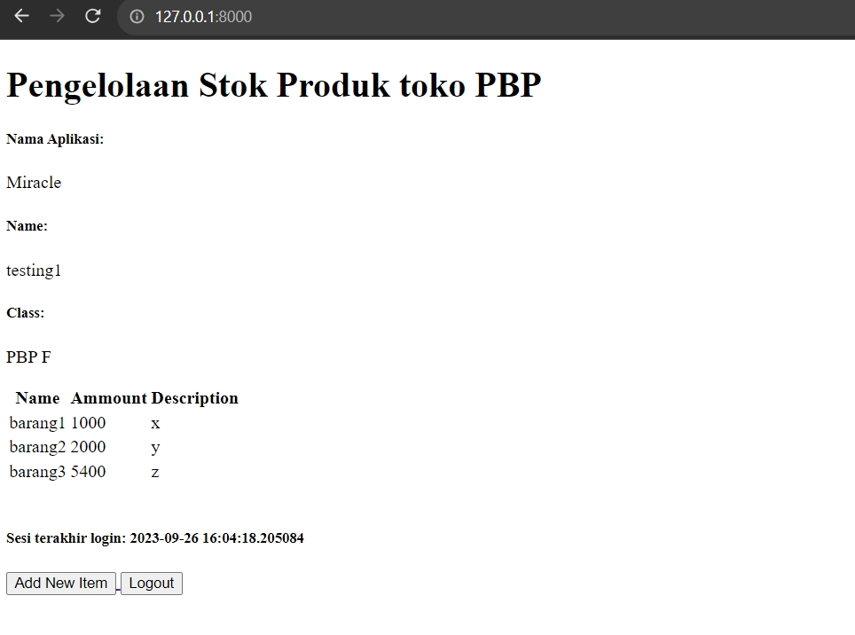
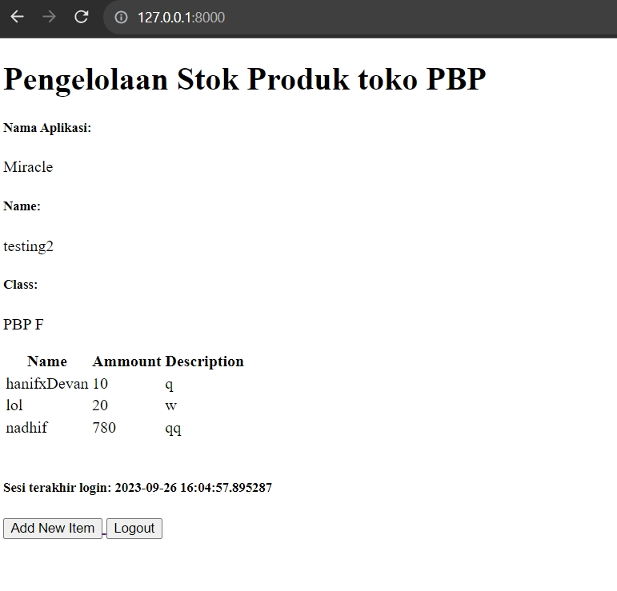

Link Url Website : https://website-v1.adaptable.app/main/

    
Tugas 2 

1. Jelaskan bagaimana cara kamu mengimplementasikan checklist di atas secara step-by-step (bukan hanya sekadar mengikuti tutorial).

    a. Membuat sebuah projek django

        Dengan menggunakan syntax django-admin startproject pbptugas2 ., kita meminta framework django untuk membuatkan
        kita sebuah projek yang sudah lengkap dengan beberapa file yang penting.

    b. Membuat aplikasi dengan nama main pada proyek tersebut

        Untuk membuat app dengan nama main kita memakai syntax python manage.py startapp main.
        Setelah dijalankan maka akan muncul direktori main khusus.

    c. Melakukan routing pada proyek agar dapat menjalankan aplikasi main.

        Agar bisa menjalanlan routing, kita membuka berkas settings.py di direktori pbptugas2 dan mencari
        variable INSTALLED APPS dan menambahkan 'main' agar terdaftarkan dalam projek kita,

    d.  Membuat model pada aplikasi main dengan nama Item dan memiliki atribut wajib sebagai berikut.

        Dengan menuliskan pada models.py:
        from django.db import models

        class Item(models.Model):
            name = models.CharField(max_length=255,default="")
            amount = models.IntegerField(default=0)
            description = models.TextField(default = "")

        artinya kita membuat sebuah models pada django kita yang berisi Item yang memiiki beberapa atribut
        seperti name, amount, dan description

    e.  Membuat sebuah fungsi pada views.py untuk dikembalikan ke dalam sebuah template HTML yang menampilkan nama aplikasi serta   nama dan kelas kamu.
        Dengan menuliskan pada views.py:

        from django.shortcuts import render
            def show_main(request):
                context = {
                'application': 'Miracle',
                'name': 'Kevin Ignatius Wijaya',
                'class': 'PBP F'
             }

        return render(request, "main.html", context)

        artinya kita meminta parameter request yang berfungsi mengatur permintaan HTTP dengan template seperti 
        folder templates.
        lalu mengirimkan context yang berisi data untuk diberikan kepada templates dan mereturn render 
        untuk merender tampilan pada HTML.
    
    f. Membuat sebuah routing pada urls.py aplikasi main untuk memetakan fungsi yang telah dibuat pada views.py.

        Dengan menuliskan urls.py dalam direkotri main :

            from django.urls import path
            from main.views import show_main

            app_name = 'main'

            urlpatterns = [
            path('', show_main, name='show_main'),
            ]
        
        Berkas ini mengatur rute url yang terkait pada aplikasi main 
        dengan menggunakan import path kita mendefinisikan pola urls nya lalu menggunakan fungsi show_main
        dari modulnya untuk menampilkan views.py ketika url diakses.

    g. Melakukan deployment ke Adaptable terhadap aplikasi yang sudah dibuat sehingga nantinya dapat diakses oleh teman-temanmu melalui Internet.

        Membuat akun adaptable lalu memasukan repo github projek yang diinginkan. Lalu memilih python app template , postgres sql dan memberikan python version serta menuliskan command python manage.py migrate && gunicorn pbptugas2.wsgi. Lalu memberikan nama aplikasi dan http port. Setelah itu mendeploynya ke adaptable.

2. Buatlah bagan yang berisi request client ke web aplikasi berbasis Django beserta responnya dan jelaskan pada bagan tersebut kaitan antara urls.py, views.py, models.py, dan berkas html.

Pertama - tama saat user meminta request untuk melihat maka akan mengirimkan request ke urls.py dan meneruskan request tersebut ke views.py. Kemudian dari views.py akan mencari templates pada directory templates yang punya .html dan akan mengambil nya menjadi template.   Disaat yang bersamaan views.py akan melakukan read/write data pada models.py yang berhubungan dengan database pada website django. Selanjutnya views.py akan mengirimkan http response di html yang akan ditampilkan kepada user. 

3. Jelaskan mengapa kita menggunakan virtual environment? Apakah kita tetap dapat membuat aplikasi web berbasis Django tanpa 
menggunakan virtual environment?

    Ada 3 alasan:

    a. Untuk mengisolasi pustaka dan modul
     karena setiap proyek memperlukan pustaka dan modul yang berbeda

    b. Untuk menghindari konflik pustaka
    jika ingin membuat sebuah proyek dengan versi pustaka yang sama kita memerlukan virtual envinronment agar tidak konflik saat 1 proyek memiliki beberapa versi

    c. Untuk mempermudah pengembangan
    kita bisa ganti ganti dari 1 proyek ke proyek lain dengan mudah saat menggunakan virtual environment .

    kita tetap bisa membuat aplikasi dgn framework django tanpa virtual environment namun bisa menyebabka konflik versi pustaka dan proyek yang tidak stabil

4. Jelaskan apakah itu MVC, MVT, MVVM dan perbedaan dari ketiganya

MVC, MVT, dan MVVM adalah tiga desain arsitektur yang umum digunakan dalam pengembangan perangkat lunak. Ketiganya membagi aplikasi menjadi tiga komponen utama: model, view, dan controller.

MVC (Model-View-Controller) adalah desain arsitektur yang paling umum digunakan. 

MVC membagi aplikasi menjadi tiga komponen utama:

Model: Model adalah komponen yang bertanggung jawab untuk menyimpan data dan logika bisnis.

View: View adalah komponen yang bertanggung jawab untuk menampilkan data ke pengguna.

Controller: Controller adalah komponen yang bertanggung jawab untuk menerima input dari pengguna dan memperbarui model dan view.

MVT (Model-View-Template) adalah desain arsitektur yang mirip dengan MVC, tetapi dengan perbedaan utama bahwa view dan template digabungkan menjadi satu komponen.

Model: Sama seperti MVC.

View: Sama seperti MVC, tetapi juga bertanggung jawab untuk menghasilkan kode HTML untuk menampilkan data ke pengguna.

Template: Template adalah kode HTML statis yang digunakan oleh view untuk menghasilkan kode HTML yang dinamis.

MVVM (Model-View-ViewModel) adalah desain arsitektur yang mirip dengan MVC, tetapi dengan perbedaan utama bahwa view dan controller digabungkan menjadi satu komponen.

Model: Sama seperti MVC.

View: Sama seperti MVC, tetapi juga bertanggung jawab untuk menerima input dari pengguna dan memperbarui model.

ViewModel: ViewModel adalah komponen yang bertindak sebagai mediator antara model dan view. ViewModel bertanggung jawab untuk menyediakan data yang diperlukan ke view dan memperbarui model berdasarkan input dari view.

Perbedaan utama dari ketiga desain arsitektur ini adalah peran dari controller dan view. Pada MVC, controller bertanggung jawab untuk menerima input dari pengguna dan memperbarui model dan view. Pada MVT, view dan template digabungkan menjadi satu komponen yang bertanggung jawab untuk menampilkan data ke pengguna dan menerima input dari pengguna. Pada MVVM, view dan controller digabungkan menjadi satu komponen yang bertanggung jawab untuk menampilkan data ke pengguna dan memperbarui model.

    
Tugas 3

1.  Apa perbedaan antara form POST dan form GET dalam Django?

    Pada pengiriman data, POST dikirimkan dalam badan permintaan HTTP. Ini berarti data tidak terlihat di URL dan lebih aman untuk mengirim data sensitif seperti kata sandi. Sedangkan pada GET Data yang dikirimkan disertakan dalam URL sebagai parameter. Ini membuat data terlihat dan bisa diakses dengan mudah melalui log server atau riwayat peramban. 

2. Apa perbedaan utama antara XML, JSON, dan HTML dalam konteks pengiriman data?

    XML, JSON, dan HTML adalah tiga format yang berbeda digunakan untuk berbagai tujuan dalam konteks pengiriman data di web dan komunikasi antar aplikasi. 

    XML digunakan untuk menggambarkan, menyimpan, dan mengirimkan data terstruktur. Ini sering digunakan dalam pertukaran data antar aplikasi dan konfigurasi.

    JSON digunakan untuk pertukaran data antar aplikasi dan sering digunakan dalam pengembangan web. Ini adalah format data yang sangat ringan dan mudah dipahami oleh manusia.

    HTML digunakan untuk merender halaman web di peramban web. Ini tidak digunakan secara langsung untuk pertukaran data, tetapi untuk menampilkan konten web kepada pengguna.

3. Mengapa JSON sering digunakan dalam pertukaran data antara aplikasi web modern?

    a. Ringan dan Mudah Dipahami: JSON memiliki struktur data yang sederhana dan ringan.
    
    b. Notasi Objek: JSON mendukung notasi objek dan array.

    c. Mendukung Tipe Data Dasar seperti string, int, boolean, array, dll.
    
    d. Parsial Parsing: JSON memungkinkan Anda untuk menguraikan atau mengakses bagian-bagian tertentu dari data tanpa perlu menguraikan seluruh struktur data. I

    e. Dukungan pada Banyak Bahasa Pemrograman

    f. Kompatibilitas dengan JavaScript

    g. Dokumentasi yang Abundan

    h. Kemampuan dalam Pengiriman Synchronous dan Asynchronous: JSON dapat digunakan dalam pertukaran data baik dalam mode pengiriman synchronous (permintaan-respons langsung) maupun asynchronous (mis. melalui WebSockets) dalam aplikasi web modern.

    i. Umum dan Standar: JSON telah menjadi standar de facto dalam pertukaran data di seluruh web. Ini berarti banyak aplikasi, layanan, dan perangkat lunak yang ada mendukung JSON secara alami.

 4. Jelaskan bagaimana cara kamu mengimplementasikan checklist di atas secara step-by-step (bukan hanya sekadar mengikuti tutorial).

a. Membuat input form untuk menambahkan objek model pada app sebelumnya
<pre>
    from django.forms import ModelForm
    from main.models import Item

    class ProductForm(ModelForm):
        class Meta:
            model = Item
            fields = ["name", "amount", "description"]

</pre>

model = Item. Ini menunjukan bahwa yang digunakan sebagai form adalah Item. dan field adalah attribute dari model Item.

b. Tambahkan 5 fungsi views untuk melihat objek yang sudah ditambahkan dalam format HTML, XML, JSON, XML by ID, dan JSON by ID.

    
    def create_item(request):
    form = ItemForm(request.POST or None)

    if form.is_valid() and request.method == "POST":
        form.save()
        return HttpResponseRedirect(reverse('main:show_main'))

    context = {'form': form}
    return render(request, "create_item.html", context)

Fungsi diatas digunakan untuk melihat objek dlm format html

    def show_xml(request):
    data = Item.objects.all()
    return HttpResponse(serializers.serialize("xml", data), content_type="application/xml")

    def show_xml_by_id(request, id):
    data = Item.objects.filter(pk=id)
    return HttpResponse(serializers.serialize("xml", data), content_type="application/xml")

    def show_json(request):
    data = Item.objects.all()
    return HttpResponse(serializers.serialize("json", data), content_type="application/json")

    def show_json_by_id(request, id):
    data = Item.objects.filter(pk=id)
    return HttpResponse(serializers.serialize("json", data), content_type="application/json")

Fungsi show_xml untuk menview dalam xml

Fungsi show_xml_id untuk bisa menview dlm xml/id dan idnya

Fungsi show_json untuk menview json nya

Fungsi show_json_id untuk bisa menview dlm json/id dan idnya

keempat fungsi ini digunakan untuk menerima parameter request. Fungsi create_item untuk menambahkan objek tanpa harus dari admin

5. Membuat routing URL untuk masing-masing views yang telah ditambahkan pada poin 2.

    <pre>

    path('create-item', create_item, name='create_item'),
    
    path('xml/', show_xml, name='show_xml'),

    path('json/', show_json, name='show_json'), 
    
    path('xml/<int:id>/', show_xml_by_id, name='show_xml_by_id'),

    path('json/<int:id>/', show_json_by_id, name='show_json_by_id'),
    </pre>

    path(a,b,c)

    a untuk mengaksesnya pada website atau postman di urlnya

    b untuk mengambil dari function yang ada pada views.py

    c hanyalah nama

    
Tugas 4

1. Apa itu Django UserCreationForm, dan jelaskan apa kelebihan dan kekurangannya?

    UserCreationForm adalah bagian dari kerangka kerja Django yang digunakan untuk membuat formulir pendaftaran pengguna dalam aplikasi web. Formulir ini secara khusus dirancang untuk memudahkan proses pendaftaran pengguna dengan mengumpulkan informasi yang diperlukan, seperti username, password, dan alamat email. 

    Kelebihan :
    
    a. Pemeliharaan Keamanan. 
    
    memastikan kalau passwordnya itu terenkripsi dengan benar 

    b. Validasi bawaan. 
    
    Sudah ada validasi yang lengkap sesuai template

    c. Fleksibilitas

    d. Intgerasi mudaht

    sudah terintegrasi dengan sistem otentikasi dan manajemen pengguna di django di code 'django.contrib.auth'

    Kekurangan:

    a. Tampilan bawaan terlalu simple

    b. Tidak dapat digunakan di semua kasus

    c. Tidak semua autentikasi bisa.

2.  Apa perbedaan antara autentikasi dan otorisasi dalam konteks Django, dan mengapa keduanya penting?

Autentikasi adalah proses untuk mengidentifikasi pengguna atau entitas yang mencoba mengakses sistem atau aplikasi.Sedangkan Otorisasi adalah proses yang mengontrol apa yang diizinkan pengguna lakukan setelah mereka berhasil diotentikasi. 

Secara simple perbedaanya adalah autentikasi menanyakan siapa anda dan otorisasi bertanya apa yang boleh anda lakukan. Autentikasi mengatur akses pengguna sedangkan otorisasi mengatur hak - hak pengguna.

Mereka penting karena mempengaruhi keamanan, kontrol akses, dan kepatuhan. Karena mereka kita bisa membuat web dengan aman dan terstruktur tanpa ada kebocoran data dan hal lainnya yang tidak diinginkan.

3. Apa itu cookies dalam konteks aplikasi web, dan bagaimana Django menggunakan cookies untuk mengelola data sesi pengguna?

Cookies dalam konteks aplikasi web adalah file kecil yang disimpan di sisi klien (di browser pengguna) dan digunakan untuk menyimpan informasi tertentu yang dapat diakses oleh server web saat pengguna mengunjungi situs web yang sama di masa mendatang.

Django menggunakan cookies untuk mengelola data sesi pengguna dengan cara yang disebut cookie-based session management. Ini memungkinkan aplikasi Django menyimpan dan mengambil data sesi pengguna di antara berbagai permintaan HTTP tanpa perlu menyimpannya di server.

Cara django adalah Mengidentifikasi Pengguna lalu Menyimpan Data Sesi lalu Mengirim Cookie ke Klien lalu Menggunakan Cookie lalu Menghapus Cookie.

4. Apakah penggunaan cookies aman secara default dalam pengembangan web, atau apakah ada risiko potensial yang harus diwaspadai?

Penggunaan cookies dalam pengembangan web tidak aman secara default, tetapi juga tidak berbahaya.

Ada beberapa risiko yang harus diwaspadai seperti Cookie Hijacking, Cross-Site Scripting (XSS), Cross-Site Request Forgery (CSRF), dan Tracking dan Privasi. Untuk itu kita harus mengakses website yang sudah terenkripsi agar aman.

5. Jelaskan bagaimana cara kamu mengimplementasikan checklist di atas secara step-by-step (bukan hanya sekadar mengikuti tutorial).

a. Mengimplementasikan fungsi registrasi, login, dan logout untuk memungkinkan pengguna untuk mengakses aplikasi sebelumnya dengan lancar.

Untuk fungsi registrasi kita membuat sebuah fungsi register di views.py dengan kode seperti berikut 

    from django.shortcuts import redirect
    from django.contrib.auth.forms import UserCreationForm
    from django.contrib import messages  
    
    def register(request):
    form = UserCreationForm()

    if request.method == "POST":
        form = UserCreationForm(request.POST)
        if form.is_valid():
            form.save()
            messages.success(request, 'Your account has been successfully created!')
            return redirect('main:login')
    context = {'form':form}
    return render(request, 'register.html', context)

Pertama kita mengimpor UserCreationForm lalu menuliskan function ini lalu menambakan template di register.html agar pengguna bisa menregister lalu kita menambahkan di urls.py 

    from main.views import register
    path('register/', register, name='register'),

Lalu untuk fungsi login logout sama halnya dengan register

    from django.contrib.auth import authenticate, login,logout

    def login_user(request):
    if request.method == 'POST':
        username = request.POST.get('username')
        password = request.POST.get('password')
        user = authenticate(request, username=username, password=password)
        if user is not None:
            login(request, user)
            return redirect('main:show_main')
        else:
            messages.info(request, 'Sorry, incorrect username or password. Please try again.')
    context = {}
    return render(request, 'login.html', context)

    def logout_user(request):
    logout(request)
    return redirect('main:login')

Setelah memasukan ini di views.py lalu membuat templatenya di folder templates login.html dan logout.html

Lalu mengubah urlsnya sama seperti di register pada urls.py

    from django.contrib.auth import logout,login,authenticate

    path('login/', login_user, name='login'),
    path('logout/', logout_user, name='logout'),

Ini dilakukan agar bisa mengakses urlnya

Ini adalah cara simple agar bisa register,login, dan logout

b.  Membuat dua akun pengguna dengan masing-masing tiga dummy data menggunakan model yang telah dibuat pada aplikasi sebelumnya untuk setiap akun di lokal.

ini adalah 2 acc dgn 3 dummy data testingnya

c. Menghubungkan model Item dengan User.

untuk melakukan ini pertama menambahkan ini di models.py

    from django.contrib.auth.models import User

    class Item(models.Model):
    user = models.ForeignKey(User, on_delete=models.
    CASCADE)

ini untuk mengubah modelnya agar bisa terhubung item dengan user sehingga setiap user akan punya itemnya masing masing

lalu mengubah function create_item di views.py seperti ini 

    def create_item(request):
    form = ItemForm(request.POST or None)

    if form.is_valid() and request.method == "POST":
     item = form.save(commit=False)
     item.user = request.user
     item.save()
     return HttpResponseRedirect(reverse('main:show_main'))

lalu mengubah function show_main seperti

    def show_main(request):
    items = Item.objects.filter(user=request.user)

    context = {
        'name': request.user.username,

ini diubah untuk menampilkan object item kepada pengguna yang sedang login 

d. Menampilkan detail informasi pengguna yang sedang logged in seperti username dan menerapkan cookies seperti last login pada halaman utama aplikasi.

Untuk melakukan nya kita membuka views.py lalu mengubah fungsi login_user menjadi

    if user is not None:
        login(request, user)
        response= HttpResponseRedirect(reverse("main:show_main")) 
        response.set_cookie('last_login', str(datetime.datetime.now()))
        return response

lalu mengubah fungsi show_main menjadi

    context = {
    'name': 'Kevin Ignatius Wijaya',
    'class': 'PBP F',
    'items': items,
    'last_login': request.COOKIES['last_login'],
}

lalu mengubah fungsi logout_user menjadi

    def logout_user(request):
        logout(request)
        response = HttpResponseRedirect(reverse('main:login'))
        response.delete_cookie('last_login')
        return response

lalu menambhkan ini di main.html

    <h5>Sesi terakhir login: {{ last_login }}</h5>

lalu kita akan bisa melihat last login di appnya

    
Tugas 5 

1.  Jelaskan manfaat dari setiap element selector dan kapan waktu yang tepat untuk menggunakannya.

Elemen selektor adalah salah satu jenis selektor CSS yang digunakan untuk memilih dan menggaya elemen HTML berdasarkan jenis elemennya.

a. Universal Selector (*):

Manfaat: Universal selector memilih semua elemen dalam 
dokumen HTML.

Kapan Digunakan: Universal selector sebaiknya digunakan dengan hati-hati karena dapat mempengaruhi semua elemen dalam dokumen. Ini berguna jika Anda perlu menerapkan gaya umum untuk semua elemen.

b. Type Selector (Elemen Selector):

Manfaat: Type selector memilih elemen berdasarkan jenis elemennya (misalnya, div, p, h1, dll.).

Kapan Digunakan: Digunakan ketika Anda ingin menggaya semua elemen dengan jenis tertentu dalam dokumen. Ini adalah salah satu selektor paling umum yang digunakan.

c. Class Selector (Selektor Kelas):

Manfaat: Class selector memilih elemen berdasarkan atribut class yang ditetapkan pada elemen.

Kapan Digunakan: Cocok digunakan ketika Anda ingin menggaya sekelompok elemen yang memiliki atribut class yang sama. Ini memungkinkan Anda menerapkan gaya khusus pada elemen tertentu.

d. ID Selector (Selektor ID):

Manfaat: ID selector memilih elemen berdasarkan atribut id yang ditetapkan pada elemen.

Kapan Digunakan: Sebaiknya digunakan dengan bijak karena ID harus unik dalam satu halaman HTML. Biasanya digunakan untuk mengidentifikasi dan menggaya elemen tertentu yang unik.

e. Attribute Selector (Selektor Atribut):

Manfaat: Attribute selector memilih elemen berdasarkan nilai atribut mereka.

Kapan Digunakan: Berguna ketika Anda ingin memilih elemen berdasarkan atribut khusus, misalnya, untuk menggaya semua tautan dengan atribut href tertentu.

f. seudo-class Selector (Selektor Pseudo-class):

Manfaat: Pseudo-class selector memilih elemen dalam keadaan tertentu atau interaksi pengguna, seperti :hover, :active, :focus, dll.

Kapan Digunakan: Digunakan untuk memberikan efek gaya saat pengguna berinteraksi dengan elemen, seperti mengubah warna tautan saat dihover.

g. Pseudo-element Selector (Selektor Pseudo-element):

Manfaat: Pseudo-element selector memungkinkan Anda memilih dan menggaya bagian-bagian khusus dari elemen, seperti ::before dan ::after.

Kapan Digunakan: Digunakan untuk membuat elemen tambahan sebelum atau sesudah elemen yang dipilih dan menggaya elemen tambahan tersebut.

2. Jelaskan HTML5 Tag yang kamu ketahui.

header: Digunakan untuk mendefinisikan bagian atas atau kepala dari sebuah halaman web. Biasanya berisi elemen-elemen seperti judul, logo, dan navigasi utama.

nav: Mendefinisikan sebuah bagian navigasi dalam dokumen web. Ini digunakan untuk mengelompokkan tautan atau menu navigasi.

section: Digunakan untuk mengelompokkan konten yang memiliki tema atau topik tertentu dalam halaman web. Ini membantu dalam pengorganisasian konten.

details dan summary: details digunakan untuk membuat konten yang dapat diperluas dan disusutkan, dengan summary sebagai teks yang menunjukkan ringkasan dari konten yang dapat diperluas.

input (dalam konteks HTML5): Berbagai jenis input seperti input type="text", input type="email", dan input type="date" yang memungkinkan pengguna memasukkan data dengan format tertentu.

3.  Jelaskan perbedaan antara margin dan padding.

Margin adalah ruang di luar elemen (di antara elemen dan elemen lainnya) yang membantu mengontrol jarak antara elemen ini dengan elemen-elemen lain di sekitarnya.

Margin tidak memiliki latar belakang atau warna. Ini adalah area transparan yang memisahkan elemen dari elemen-elemen lainnya.

Padding adalah ruang di dalam elemen, di antara batas elemen dan kontennya sendiri. Ini memberikan jarak antara konten elemen dan tepi elemen tersebut.

Padding digunakan untuk mengontrol seberapa dekat atau jauh konten elemen dari tepinya.

4. Jelaskan perbedaan antara framework CSS Tailwind dan Bootstrap. Kapan sebaiknya kita menggunakan Bootstrap daripada Tailwind, dan sebaliknya?

Tailwind CSS: Tailwind CSS adalah kerangka kerja CSS utilitas pertama yang memungkinkan Anda membangun tampilan web dengan memanfaatkan banyak kelas utilitas. Artinya menggabungkan berbagai kelas ke elemen HTML untuk menggaya dan mengatur tampilan.

Bootstrap: Bootstrap adalah kerangka kerja CSS berbasis komponen. Artinya menggunakan komponen-komponen yang telah ditentukan sebelumnya dan dikustomisasi sesuai kebutuhan Anda.

Tailwind CSS: Tailwind sangat fleksibel dan memungkinkan untuk menyesuaikan setiap aspek tampilan dengan mudah dengan mengedit konfigurasi kelas-kelas utilitas yang ada.

Bootstrap: Bootstrap menawarkan kustomisasi yang lebih terbatas karena komponen-komponennya sudah dibuat sebelumnya. Kita perlu menimpa gaya-gaya bawaan Bootstrap untuk membuat tampilan yang unik.

Bootstrap Sebaiknya Digunakan:

Ketika ingin membangun tampilan dengan cepat menggunakan komponen yang sudah ada.

Ketika tidak memerlukan tingkat kustomisasi yang tinggi.

Ketika mengutamakan keseragaman dalam desain tampilan web.

Tailwind CSS Sebaiknya Digunakan:

Ketika ingin tingkat kustomisasi yang tinggi dan fleksibilitas dalam merancang tampilan.

Ketika tidak keberatan dengan ukuran file CSS yang lebih besar.

Ketika ingin memanfaatkan pendekatan utilitas CSS untuk mengatur tampilan.

5. Jelaskan bagaimana cara kamu mengimplementasikan checklist di atas secara step-by-step (bukan hanya sekadar mengikuti tutorial).

1. Kustomisasi desain pada templat HTML yang telah dibuat pada Tugas 4 dengan menggunakan CSS atau CSS framework (seperti Bootstrap, Tailwind, Bulma) dengan ketentuan sebagai berikut

Pertama kita menambahkan file bootstrap nya dulu dengan cara menambahkan kode ini pada base.html di bagian head:
        link href="https://cdn.jsdelivr.net/npm/bootstrap@5.3.2/dist/css/bootstrap.min.css" rel="stylesheet" integrity="sha384-T3c6CoIi6uLrA9TneNEoa7RxnatzjcDSCmG1MXxSR1GAsXEV/Dwwykc2MPK8M2HN" crossorigin="anonymous"

lalu kita tambahkan ini
Dengan menambahkan kode bootstrap dibawah ini untuk menambahkan navigation bar nya

    <nav class="navbar navbar-expand-lg bg-body-tertiary">
            

              <a class="navbar-brand" href="#">Navbar</a>
              <button class="navbar-toggler" type="button" data-bs-toggle="collapse" data-bs-target="#navbarSupportedContent" aria-controls="navbarSupportedContent" aria-expanded="false" aria-label="Toggle navigation">
                
              </button>
              

                <ul class="navbar-nav me-auto mb-2 mb-lg-0">
                  <li class="nav-item">
                    <a class="nav-link active" aria-current="page" href="#">Home</a>
                  </li>
                  <li class="nav-item">
                    <a class="nav-link" href="#">Link</a>
                  </li>
                  <li class="nav-item dropdown">
                    <a class="nav-link dropdown-toggle" href="#" role="button" data-bs-toggle="dropdown" aria-expanded="false">
                      Dropdown
                    </a>
                    <ul class="dropdown-menu">
                      <li><a class="dropdown-item" href="#">Action</a></li>
                      <li><a class="dropdown-item" href="#">Another action</a></li>
                      <li>
</li>
                      <li><a class="dropdown-item" href="#">Something else here</a></li>
                    </ul>
                  </li>
                  <li class="nav-item">
                    <a class="nav-link disabled" aria-disabled="true">Disabled</a>
                  </li>
                </ul>
                <form class="d-flex" role="search">
                  <input class="form-control me-2" type="search" placeholder="Search" aria-label="Search">
                  <button class="btn btn-outline-success" type="submit">Search</button>
                </form>
              

            

          </nav>

2. Kustomisasi halaman login, register, dan tambah inventori semenarik mungkin.

Dengan menambahkan

kode di bagian style contoh
  color : blue
   kita sudah menambahkan warnanya

Kodenya bisa diliat di login.html main.html register.html dan base.html

3. Kustomisasi halaman daftar inventori menjadi lebih berwarna maupun menggunakan apporach lain seperti menggunakan Card.

Dengan menambahkan kode css di style seperti ini 

Bisa dilihat di kode main.html untuk customisasi table dll.

    .card {
            border: 1px solid #ccc;
            border-radius: 5px;
            padding: 20px;
            background-color: orange;
            width: 1000px; 
            margin: 0 auto; 
        }

        
        .custom-table {
            width: 100%;
            border-collapse: collapse;
            margin-top: 10px; 
        }

        .custom-table th,
        .custom-table td {
            padding: 10px;
            border: 1px solid #ccc;
            text-align: left;
            background-color: aquamarine; /* warna isi tablenya*/
        }

        .custom-table th {
            background-color: red; /*warna isi table headernya*/
        }

