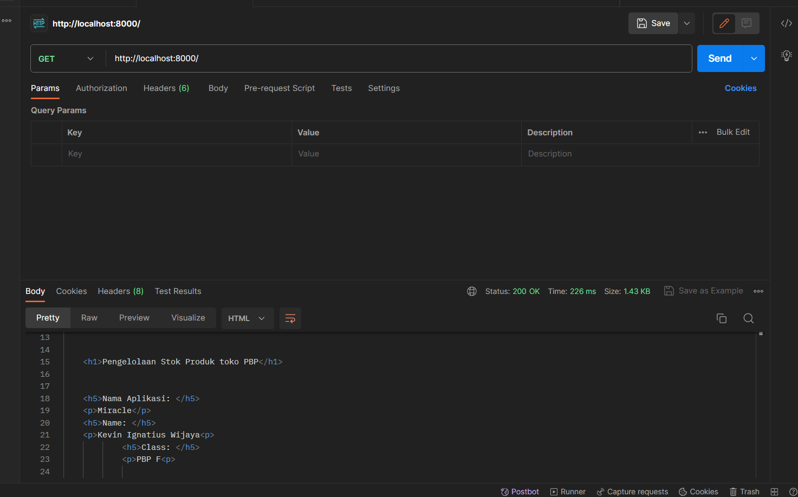
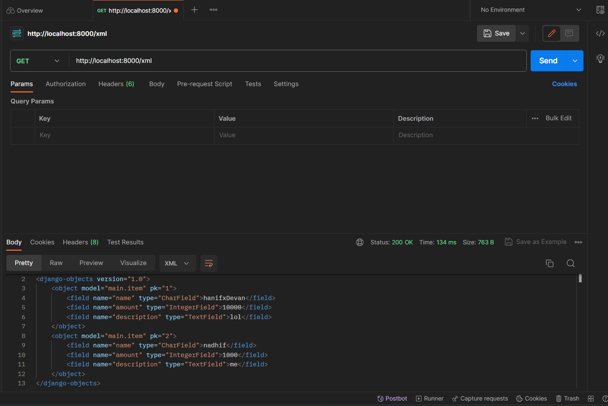
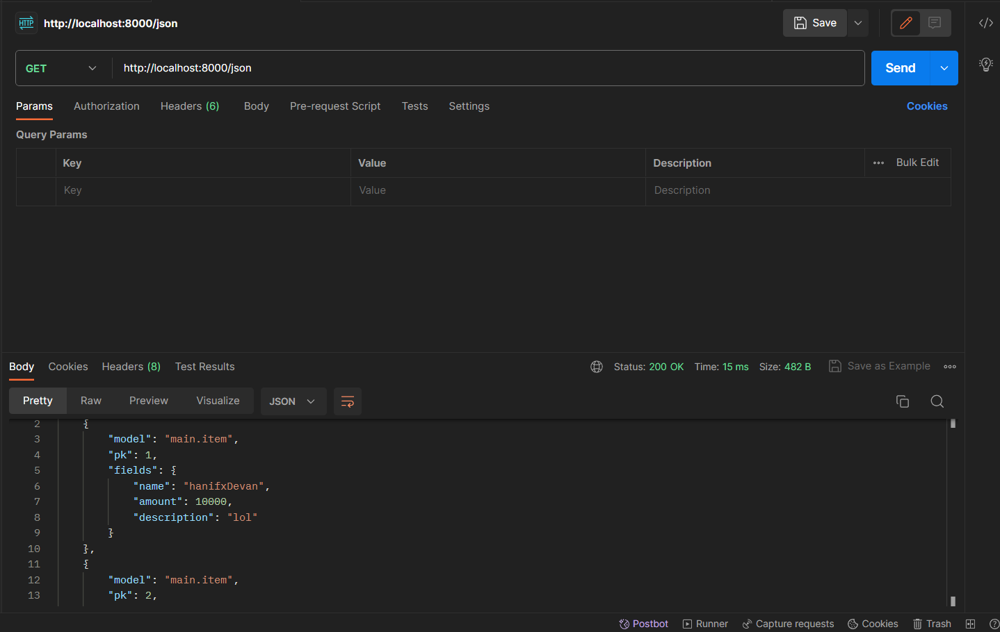
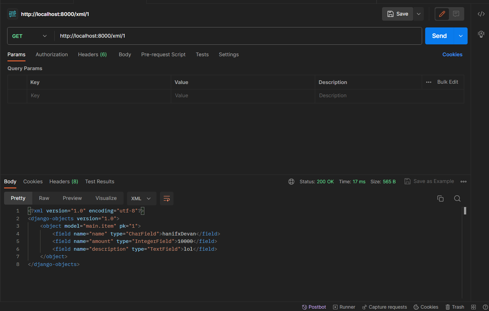
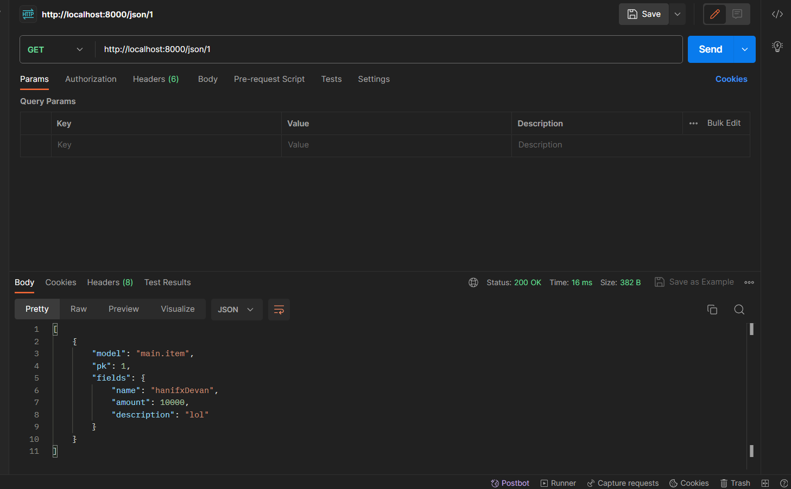

Link Url Website : https://website-v1.adaptable.app/main/

    
Tugas 2 

1. Jelaskan bagaimana cara kamu mengimplementasikan checklist di atas secara step-by-step (bukan hanya sekadar mengikuti tutorial).

    a. Membuat sebuah projek django

        Dengan menggunakan syntax django-admin startproject pbptugas2 ., kita meminta framework django untuk membuatkan
        kita sebuah projek yang sudah lengkap dengan beberapa file yang penting.

    b. Membuat aplikasi dengan nama main pada proyek tersebut

        Untuk membuat app dengan nama main kita memakai syntax python manage.py startapp main.
        Setelah dijalankan maka akan muncul direktori main khusus.

    c. Melakukan routing pada proyek agar dapat menjalankan aplikasi main.

        Agar bisa menjalanlan routing, kita membuka berkas settings.py di direktori pbptugas2 dan mencari
        variable INSTALLED APPS dan menambahkan 'main' agar terdaftarkan dalam projek kita,

    d.  Membuat model pada aplikasi main dengan nama Item dan memiliki atribut wajib sebagai berikut.

        Dengan menuliskan pada models.py:
        from django.db import models

        class Item(models.Model):
            name = models.CharField(max_length=255,default="")
            amount = models.IntegerField(default=0)
            description = models.TextField(default = "")

        artinya kita membuat sebuah models pada django kita yang berisi Item yang memiiki beberapa atribut
        seperti name, amount, dan description

    e.  Membuat sebuah fungsi pada views.py untuk dikembalikan ke dalam sebuah template HTML yang menampilkan nama aplikasi serta   nama dan kelas kamu.
        Dengan menuliskan pada views.py:

        from django.shortcuts import render
            def show_main(request):
                context = {
                'application': 'Miracle',
                'name': 'Kevin Ignatius Wijaya',
                'class': 'PBP F'
             }

        return render(request, "main.html", context)

        artinya kita meminta parameter request yang berfungsi mengatur permintaan HTTP dengan template seperti 
        folder templates.
        lalu mengirimkan context yang berisi data untuk diberikan kepada templates dan mereturn render 
        untuk merender tampilan pada HTML.
    
    f. Membuat sebuah routing pada urls.py aplikasi main untuk memetakan fungsi yang telah dibuat pada views.py.

        Dengan menuliskan urls.py dalam direkotri main :

            from django.urls import path
            from main.views import show_main

            app_name = 'main'

            urlpatterns = [
            path('', show_main, name='show_main'),
            ]
        
        Berkas ini mengatur rute url yang terkait pada aplikasi main 
        dengan menggunakan import path kita mendefinisikan pola urls nya lalu menggunakan fungsi show_main
        dari modulnya untuk menampilkan views.py ketika url diakses.

    g. Melakukan deployment ke Adaptable terhadap aplikasi yang sudah dibuat sehingga nantinya dapat diakses oleh teman-temanmu melalui Internet.

        Membuat akun adaptable lalu memasukan repo github projek yang diinginkan. Lalu memilih python app template , postgres sql dan memberikan python version serta menuliskan command python manage.py migrate && gunicorn pbptugas2.wsgi. Lalu memberikan nama aplikasi dan http port. Setelah itu mendeploynya ke adaptable.

2. Buatlah bagan yang berisi request client ke web aplikasi berbasis Django beserta responnya dan jelaskan pada bagan tersebut kaitan antara urls.py, views.py, models.py, dan berkas html.

Pertama - tama saat user meminta request untuk melihat maka akan mengirimkan request ke urls.py dan meneruskan request tersebut ke views.py. Kemudian dari views.py akan mencari templates pada directory templates yang punya .html dan akan mengambil nya menjadi template.   Disaat yang bersamaan views.py akan melakukan read/write data pada models.py yang berhubungan dengan database pada website django. Selanjutnya views.py akan mengirimkan http response di html yang akan ditampilkan kepada user. 

3. Jelaskan mengapa kita menggunakan virtual environment? Apakah kita tetap dapat membuat aplikasi web berbasis Django tanpa 
menggunakan virtual environment?

    Ada 3 alasan:

    a. Untuk mengisolasi pustaka dan modul
     karena setiap proyek memperlukan pustaka dan modul yang berbeda

    b. Untuk menghindari konflik pustaka
    jika ingin membuat sebuah proyek dengan versi pustaka yang sama kita memerlukan virtual envinronment agar tidak konflik saat 1 proyek memiliki beberapa versi

    c. Untuk mempermudah pengembangan
    kita bisa ganti ganti dari 1 proyek ke proyek lain dengan mudah saat menggunakan virtual environment .

    kita tetap bisa membuat aplikasi dgn framework django tanpa virtual environment namun bisa menyebabka konflik versi pustaka dan proyek yang tidak stabil

4. Jelaskan apakah itu MVC, MVT, MVVM dan perbedaan dari ketiganya

MVC, MVT, dan MVVM adalah tiga desain arsitektur yang umum digunakan dalam pengembangan perangkat lunak. Ketiganya membagi aplikasi menjadi tiga komponen utama: model, view, dan controller.

MVC (Model-View-Controller) adalah desain arsitektur yang paling umum digunakan. 

MVC membagi aplikasi menjadi tiga komponen utama:

Model: Model adalah komponen yang bertanggung jawab untuk menyimpan data dan logika bisnis.

View: View adalah komponen yang bertanggung jawab untuk menampilkan data ke pengguna.

Controller: Controller adalah komponen yang bertanggung jawab untuk menerima input dari pengguna dan memperbarui model dan view.

MVT (Model-View-Template) adalah desain arsitektur yang mirip dengan MVC, tetapi dengan perbedaan utama bahwa view dan template digabungkan menjadi satu komponen.

Model: Sama seperti MVC.

View: Sama seperti MVC, tetapi juga bertanggung jawab untuk menghasilkan kode HTML untuk menampilkan data ke pengguna.

Template: Template adalah kode HTML statis yang digunakan oleh view untuk menghasilkan kode HTML yang dinamis.

MVVM (Model-View-ViewModel) adalah desain arsitektur yang mirip dengan MVC, tetapi dengan perbedaan utama bahwa view dan controller digabungkan menjadi satu komponen.

Model: Sama seperti MVC.

View: Sama seperti MVC, tetapi juga bertanggung jawab untuk menerima input dari pengguna dan memperbarui model.

ViewModel: ViewModel adalah komponen yang bertindak sebagai mediator antara model dan view. ViewModel bertanggung jawab untuk menyediakan data yang diperlukan ke view dan memperbarui model berdasarkan input dari view.

Perbedaan utama dari ketiga desain arsitektur ini adalah peran dari controller dan view. Pada MVC, controller bertanggung jawab untuk menerima input dari pengguna dan memperbarui model dan view. Pada MVT, view dan template digabungkan menjadi satu komponen yang bertanggung jawab untuk menampilkan data ke pengguna dan menerima input dari pengguna. Pada MVVM, view dan controller digabungkan menjadi satu komponen yang bertanggung jawab untuk menampilkan data ke pengguna dan memperbarui model.

    
Tugas 3

1.  Apa perbedaan antara form POST dan form GET dalam Django?

    Pada pengiriman data, POST dikirimkan dalam badan permintaan HTTP. Ini berarti data tidak terlihat di URL dan lebih aman untuk mengirim data sensitif seperti kata sandi. Sedangkan pada GET Data yang dikirimkan disertakan dalam URL sebagai parameter. Ini membuat data terlihat dan bisa diakses dengan mudah melalui log server atau riwayat peramban. 

2. Apa perbedaan utama antara XML, JSON, dan HTML dalam konteks pengiriman data?

    XML, JSON, dan HTML adalah tiga format yang berbeda digunakan untuk berbagai tujuan dalam konteks pengiriman data di web dan komunikasi antar aplikasi. 

    XML digunakan untuk menggambarkan, menyimpan, dan mengirimkan data terstruktur. Ini sering digunakan dalam pertukaran data antar aplikasi dan konfigurasi.

    JSON digunakan untuk pertukaran data antar aplikasi dan sering digunakan dalam pengembangan web. Ini adalah format data yang sangat ringan dan mudah dipahami oleh manusia.

    HTML digunakan untuk merender halaman web di peramban web. Ini tidak digunakan secara langsung untuk pertukaran data, tetapi untuk menampilkan konten web kepada pengguna.

3. Mengapa JSON sering digunakan dalam pertukaran data antara aplikasi web modern?

    a. Ringan dan Mudah Dipahami: JSON memiliki struktur data yang sederhana dan ringan.
    
    b. Notasi Objek: JSON mendukung notasi objek dan array.

    c. Mendukung Tipe Data Dasar seperti string, int, boolean, array, dll.
    
    d. Parsial Parsing: JSON memungkinkan Anda untuk menguraikan atau mengakses bagian-bagian tertentu dari data tanpa perlu menguraikan seluruh struktur data. I

    e. Dukungan pada Banyak Bahasa Pemrograman

    f. Kompatibilitas dengan JavaScript

    g. Dokumentasi yang Abundan

    h. Kemampuan dalam Pengiriman Synchronous dan Asynchronous: JSON dapat digunakan dalam pertukaran data baik dalam mode pengiriman synchronous (permintaan-respons langsung) maupun asynchronous (mis. melalui WebSockets) dalam aplikasi web modern.

    i. Umum dan Standar: JSON telah menjadi standar de facto dalam pertukaran data di seluruh web. Ini berarti banyak aplikasi, layanan, dan perangkat lunak yang ada mendukung JSON secara alami.

 4. Jelaskan bagaimana cara kamu mengimplementasikan checklist di atas secara step-by-step (bukan hanya sekadar mengikuti tutorial).

a. Membuat input form untuk menambahkan objek model pada app sebelumnya
<pre>
    from django.forms import ModelForm
    from main.models import Item

    class ProductForm(ModelForm):
        class Meta:
            model = Item
            fields = ["name", "amount", "description"]

</pre>

model = Item. Ini menunjukan bahwa yang digunakan sebagai form adalah Item. dan field adalah attribute dari model Item.

b. Tambahkan 5 fungsi views untuk melihat objek yang sudah ditambahkan dalam format HTML, XML, JSON, XML by ID, dan JSON by ID.

    
    def create_item(request):
    form = ItemForm(request.POST or None)

    if form.is_valid() and request.method == "POST":
        form.save()
        return HttpResponseRedirect(reverse('main:show_main'))

    context = {'form': form}
    return render(request, "create_item.html", context)

Fungsi diatas digunakan untuk melihat objek dlm format html

    def show_xml(request):
    data = Item.objects.all()
    return HttpResponse(serializers.serialize("xml", data), content_type="application/xml")

    def show_xml_by_id(request, id):
    data = Item.objects.filter(pk=id)
    return HttpResponse(serializers.serialize("xml", data), content_type="application/xml")

    def show_json(request):
    data = Item.objects.all()
    return HttpResponse(serializers.serialize("json", data), content_type="application/json")

    def show_json_by_id(request, id):
    data = Item.objects.filter(pk=id)
    return HttpResponse(serializers.serialize("json", data), content_type="application/json")

Fungsi show_xml untuk menview dalam xml

Fungsi show_xml_id untuk bisa menview dlm xml/id dan idnya

Fungsi show_json untuk menview json nya

Fungsi show_json_id untuk bisa menview dlm json/id dan idnya

keempat fungsi ini digunakan untuk menerima parameter request. Fungsi create_item untuk menambahkan objek tanpa harus dari admin

5. Membuat routing URL untuk masing-masing views yang telah ditambahkan pada poin 2.

    <pre>

    path('create-item', create_item, name='create_item'),
    
    path('xml/', show_xml, name='show_xml'),

    path('json/', show_json, name='show_json'), 
    
    path('xml/<int:id>/', show_xml_by_id, name='show_xml_by_id'),

    path('json/<int:id>/', show_json_by_id, name='show_json_by_id'),
    </pre>

    path(a,b,c)

    a untuk mengaksesnya pada website atau postman di urlnya

    b untuk mengambil dari function yang ada pada views.py

    c hanyalah nama

